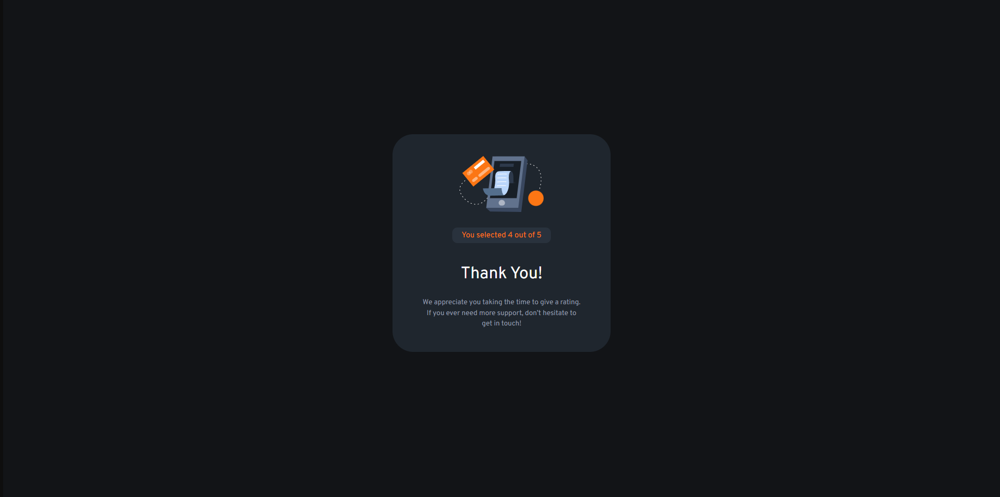

# Frontend Mentor - Interactive rating component solution

This is a solution to the [Interactive rating component challenge on Frontend Mentor](https://www.frontendmentor.io/challenges/interactive-rating-component-koxpeBUmI). Frontend Mentor challenges help you improve your coding skills by building realistic projects. 

## Table of contents

- [Overview](#overview)
  - [The challenge](#the-challenge)
  - [Screenshot](#screenshot)
  - [Links](#links)
- [My process](#my-process)
  - [Built with](#built-with)
  - [What I learned](#what-i-learned)

- [Author](#author)

## Overview

### The challenge

Users should be able to:

- View the optimal layout for the app depending on their device's screen size
- See hover states for all interactive elements on the page
- Select and submit a number rating
- See the "Thank you" card state after submitting a rating

### Screenshot

### Links

- Solution URL: [Solution Repo](https://github.com/karthiksk9819/Frontend-Mentor/tree/main/Newbie%20Projects/Interactive%20rating%20component)
- Live Site URL: [Live Site](https://app-2-blush.vercel.app/)

## My process

I started with a desktop first apporoach and then did the mobile version. 
Placed all the compoments and later positioned them using flexbox and CSS grid.
Then Completed the javascript section and finally deployed the website.

### Built with

- Semantic HTML5 markup
- CSS custom properties
- Flexbox
- Sass/SCSS , Sass partials
- Vanilla JS

### What I learned

Practiced on forEach property and learnt to depoly a responsive feedback card.

## Author

- Frontend Mentor - [profile](https://www.frontendmentor.io/profile/karthiksk9819)
